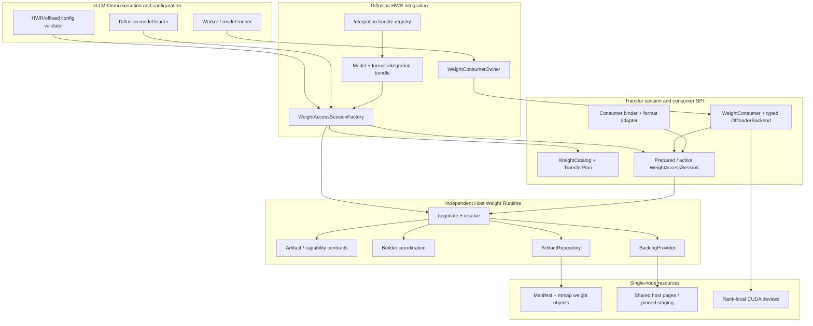
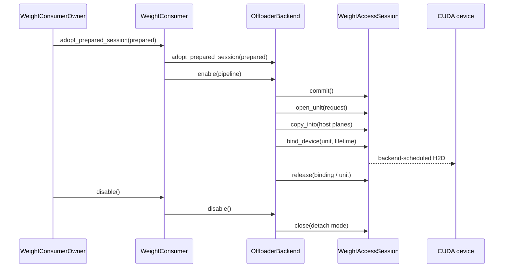

# Host Weight Runtime

The Host Weight Runtime (HWR) is a single-node, pluggable layer that owns the
identity, construction, storage, resolution, and read access of finalized host
weights. Diffusion model integration describes *what* weights mean; an
offloader describes *when* a transfer is needed; HWR provides a shared,
validated host representation to both without owning model execution.

The first use case is MiniMax-H3 FL2VA with online per-tensor FP8 transformer
weights. The same finalized artifact can feed model-level offload, layerwise
offload, or distributed layerwise offload (DLO) without AllGather. This use
case is intentionally narrow enough to freeze the contracts before adding
more formats, models, storage providers, or multi-node transport.

## V1 scope

V1 supports all of the following:

- one node with local CUDA devices;
- an immutable, content-addressed artifact published through a local mmap
  repository;
- a dense checkpoint finalized to online per-tensor FP8 with dynamic
  activation scaling and the Cutlass FP8 kernel;
- one complete rank-local host representation per compatible artifact;
- DP replicas with TP, PP, SP, CFG parallelism, HSDP, and expert parallelism
  disabled for HWR weight layout;
- model-level, layerwise, and DLO without AllGather consumers;
- a synchronous host-read contract with backend-owned CUDA scheduling;
- one ordered builder, waiters, and later read-only cache hits; and
- fail-closed multi-rank behavior when an all-rank fallback decision is not
  available.

V1 does not claim support for multi-node transport, DLO with AllGather,
checkpoint-serialized FP8, blockwise FP8, arbitrary online quantizers,
mutable weights, LoRA mutation, training updates, eviction policy, remote
storage, or cross-version artifact compatibility.

## Layered architecture

The diagram is intentionally flat inside each layer. Dependencies point down;
callbacks and results return up through the same boundary.

## Module map

| Layer | Owns | Key data and functions | Capabilities | Constraints |
| --- | --- | --- | --- | --- |
| Core contracts | Artifact identity, manifest schema, capability vocabulary, resolution outcomes | `ArtifactSpec`, `ArtifactManifest`, `WeightFormatDescriptor`, `AccessRequirements`, `CapabilityGrant`, `Ready`, `RetryableFailure`, `FatalFailure` | Canonical identity, schema validation, typed success/failure | No model paths, modules, CUDA streams, or offloader policy |
| Runtime and storage | Negotiation, build/read resolution, publication, backing lifetime | `HostWeightRuntime.negotiate()`, `resolve()`, `ArtifactRepository`, `BackingProvider`, `WeightBacking` | Builder/waiter/cache-hit resolution, immutable mmap access, injected providers | Constructor has no I/O side effects; a grant is runtime-instance-bound; close is explicit |
| Model integration bundle | Model-family matching and all model/format-specific composition | source resolver, producer/exporter factory, skeleton factory, format adapter factory, ABI and capability metadata | Adds a model/format without modifying generic session composition | Bundle selection is explicit and unambiguous; generic code must not import a concrete model or format |
| Catalog and binding | Logical model coverage and finalized tensor-to-module mapping | `WeightCatalog`, `TransferCatalog`, `TransferPlan`, `FormatBindingRecipe`, `DiffusionConsumerBinder` | Exact coverage digest, component/block/resident units, validation before publication | No heuristic tensor windows; every selected tensor belongs to exactly one declared unit role |
| Session | Transactional access to selected transfer units | `PreparedWeightAccessSession`, `WeightAccessSession`, `open_unit()`, `copy_into()`, `bind_device()`, `release()`, `suspend()`, `close()` | Bounded host staging, binding lifetime tracking, deterministic drain | A unit outside the negotiated plan is rejected; unpublished handles remain cleanup-owned |
| Consumer SPI | Strategy selection and execution-time transfer scheduling | `WeightConsumer`, typed `OffloaderBackend`, `adopt_prepared_session()`, `enable_transactionally()`, `disable()` | Model, layerwise, and DLO no-AllGather implementations share one session contract | Exactly one consumer owns the prepared session; backend must expose typed diagnostics and idempotent/retryable teardown |
| Configuration and evidence | Cross-field validation and support claims | HWR config validator, `HostWeightResolutionEvidence`, qualification result | Fail-fast unsupported combinations, reproducible evidence | Enabling HWR never silently changes offload strategy or quantization; multi-rank optional failure is fail-closed |

## Stable boundary types

The public API is the smallest set needed by storage-provider authors,
model-integration authors, and offloader authors. Concrete local storage,
MiniMax-H3, FP8 recipe internals, and qualification helpers are not public
extension points merely because they are importable within the package.

### Core runtime boundary

The core boundary consists of:

- `ArtifactSpec` and `ArtifactManifest` for requested and published identity;
- `AccessRequirements`, `CapabilityDecision`, and `CapabilityGrant` for
  negotiation;
- `ResolveOutcome` (`Ready`, `RetryableFailure`, or `FatalFailure`) for
  resolution;
- `ArtifactRepository`, `BackingProvider`, and `WeightBacking` protocols for
  injected storage; and
- `HostWeightRuntime` plus the default composition factory.

`HostWeightRuntime` does not understand diffusion pipelines, block order,
offload hooks, or quantization algorithms. It validates only the declared
artifact, backing, grant, and storage contracts.

### Model integration bundle boundary

One registered integration bundle is selected from the requested pipeline and
quantization configuration. The bundle contains the following explicit roles:

- a stable bundle ID and ABI;
- a support probe that returns a typed supported/unsupported decision;
- a checkpoint source resolver;
- artifact and producer descriptor construction;
- a producer/exporter factory used only by an authorized builder;
- a meta-skeleton factory used by every consumer rank;
- a format adapter factory and target-module contract; and
- the layout ABI and capability declarations used in artifact identity.

The registry owns selection. The generic session factory owns orchestration.
The bundle owns model and format knowledge. No bundle may silently select a
different quantization method to make a request succeed.

### Offloader backend boundary

The typed backend contract provides:

- explicit, atomic adoption of the exact `PreparedWeightAccessSession`;
- `enable(pipeline)` for installing hooks and initial residency;
- `disable()` for releasing hooks, bindings, staging buffers, and the session;
- `is_enabled()` for lifecycle introspection; and
- `host_weight_diagnostics()` for backend allocation and in-flight event
  diagnostics, plus `host_weight_session_idle_state()` for session binding and
  residency state. The consumer composes both into the common idle-state view.

The consumer never discovers session ownership through private attributes.
If enable fails after publication, the backend remains the retry target until
disable succeeds. If construction fails before ownership transfers, the
consumer retains and rolls back the prepared session.

## Artifact identity and layout

The artifact key covers every property that can change finalized bytes or
their interpretation:

- checkpoint/source fingerprint;
- model configuration digest;
- producer ID, ABI, and semantic fingerprint;
- format ID, adapter ABI, recipe schema, normalized quantization config, and
  kernel identity;
- target module type;
- TP/PP layout coordinates; and
- layout ABI.

The published manifest is immutable. A consumer validates the manifest and
compatibility digest before opening tensor views. A changed producer, format,
kernel contract, model config, or layout ABI yields a different artifact key;
it is not repaired in place.

V1 publishes complete rank-local finalized weights. DP ranks may map the same
artifact pages, but each rank owns its CUDA destination and staging resources.
No HWR interface implies an inter-rank collective.

## Transfer plans

| Consumer | Required plan | Units kept resident | Per-use transfer | Collective |
| --- | --- | --- | --- | --- |
| Model-level offload | `component` | None after idle release | Whole transformer component | None |
| Layerwise offload | `blocks_plus_resident` | Declared non-block transformer state | Complete block in execution order | None |
| DLO without AllGather | `blocks_plus_resident` | Declared non-block transformer state | Complete rank-local block through the two-slot scheduler | None |

The plan describes host layout and coverage, not execution lifetime. A
`DeviceBindingLifetime` separately declares whether a device binding is
transient or resident. This prevents a block-shaped unit that is intentionally
stationary from being misreported as a transient leak.

## Interaction contracts

### Preparation and resolution

1. Configuration validation selects exactly one HWR-compatible offloader and
   rejects unsupported topology or format combinations before model mutation.
2. The registry selects one integration bundle.
3. The session factory asks the bundle for source, artifact, format, producer,
   and skeleton composition.
4. The runtime negotiates `AccessRequirements` and returns a runtime-bound
   `CapabilityGrant` or a typed unavailable decision.
5. The build coordinator elects one builder. Waiters observe the builder-start
   record before waiting on publication.
6. The runtime resolves a build, waiter hit, or warm hit and returns a typed
   outcome.
7. The binder hydrates and validates the skeleton, compiles exact transfer
   plans, and creates a prepared session.
8. The owner publishes exactly one closed preparation result.

### Consumer handoff and execution

Ownership changes only at documented calls:

- the preparation cleanup handle owns resources until it transfers them to a
  prepared session;
- `WeightConsumerOwner` owns the published prepared session until a consumer
  adopts it;
- the consumer owns it until the backend explicitly adopts the active session;
- the backend is the cleanup and retry target after adoption; and
- a failed cleanup never reports the owner as closed.

### Suspend and close

`suspend()` is legal only with no open units or pending transient bindings.
Resident bindings follow the chosen detach mode. `close()` drains unpublished
handles, releases device bindings, detaches the prepared module binding, closes
the artifact backing, and finally closes the runtime. Repeated close is
idempotent after success; a failed close preserves enough state for retry.

## Capability and failure semantics

Capability negotiation occurs before artifact resolution. A grant identifies
the runtime instance, backing provider and ABI, backing kind, and exact access
features. It cannot be replayed against another runtime or mutated provider
registry.

Failures are typed by policy rather than inferred from message text:

| Failure | Single rank, HWR optional | Multi-rank | HWR required |
| --- | --- | --- | --- |
| Unsupported topology or format | `UseLegacy` after complete cleanup | Retryable fail-closed pending coordinated policy | Fatal/retryable preparation failure according to the typed code |
| Read-only cache miss | `UseLegacy` after complete cleanup | Retryable fail-closed | Retryable failure |
| Corrupt/incompatible artifact | Fatal | Fatal | Fatal |
| Builder/wait timeout | Optional fallback only after cleanup | Retryable fail-closed | Retryable failure |
| Consumer enable failure | Cleanup exact adopted session; retain retry owner on cleanup failure | Same | Same |

Fallback never occurs while a runtime, artifact, binding, session, or backend
remains without an owner. DLO with AllGather is rejected for HWR v1; it does
not silently switch to no-AllGather.

## Configuration contract

Legacy offload selection keeps its existing priority behavior when HWR is
disabled. When HWR is enabled:

- exactly one of model-level, layerwise, or distributed layerwise offload is
  selected;
- DLO requires `dlo_use_allgather=false`;
- `host_weight_runtime_required=true` requires an enabled HWR mode;
- an enabled HWR mode requires a non-empty root and positive wait timeout;
- transformer quantization must resolve to the supported FP8 contract; and
- unsupported topology fails before ordinary loading or hook installation.

`required=false` controls whether a clean, single-rank optional failure may
use the legacy loader. It does not broaden topology or permit ranks to make
independent fallback decisions.

## Invariants

### HWR-INV-001: Artifact identity is complete

Every byte-producing and byte-interpreting input MUST participate in artifact
identity or compatibility validation.

### HWR-INV-002: Negotiation precedes resolution

Resolution MUST use an unmodified grant issued by the same open runtime and
stable provider registry.

### HWR-INV-003: One resource, one cleanup owner

Every live runtime, artifact, binding, prepared session, active session, and
backend MUST have exactly one cleanup owner, including during exceptions.

### HWR-INV-004: Plans have exact coverage

A selected transfer plan MUST contain all and only the declared tensor roles
required by that consumer. Generic tensor windows and path-based fallback
coverage are forbidden.

### HWR-INV-005: Idle means no transient work

At the evidence gate, open units, transient bindings, and pending events MUST
be zero. Only explicitly resident bindings may remain.

### HWR-INV-006: Multi-rank failure is coordinated or fail-closed

No rank may enter the legacy loader while a peer can retain or consume the HWR
artifact unless a future all-rank policy has selected that fallback.

### HWR-INV-007: Core remains model-agnostic

The independent core MUST NOT import diffusion pipelines, offload backends,
model classes, quantization implementations, or CUDA scheduling policy.

## Validation matrix

The minimum acceptance evidence, independent of DP4 qualification, is:

| Level | Required evidence |
| --- | --- |
| Contract | Serialization, identity, grant authorization, provider injection, corruption, close/retry, and negative capability tests |
| Integration | Fake second-bundle conformance; exact prepared-session ownership across construction, enable, disable, and cleanup failures |
| Real DP1 | Legacy/build/warm output parity for model, layerwise, and DLO no-AllGather |
| Real DP2 | One builder plus one waiter, then two cache hits of the same generation; no producer/fallback; output parity and clean teardown |
| Formal memory | Dedicated cgroup-v2 measurement and verified cold-cache control; results are not formal without both |

Qualification evidence MUST distinguish functional runtime-contract success
from formal memory/performance qualification. A warm diagnostic run cannot be
reported as a cold-cache or isolated-memory result.

## Extension checklist

Before adding a new model or format:

1. implement and register one integration bundle without editing generic
   session orchestration;
2. define a new layout ABI and complete artifact identity inputs;
3. provide exact catalog and transfer-plan coverage;
4. add negative support-probe tests and a fake-bundle conformance test;
5. compare real outputs against the ordinary loader; and
6. document topology, kernel, format, and fallback constraints.

Multi-node storage or transfer is a separate provider/coordination design. It
must not be introduced by leaking transport behavior into model bundles,
transfer plans, or offloader hooks.
